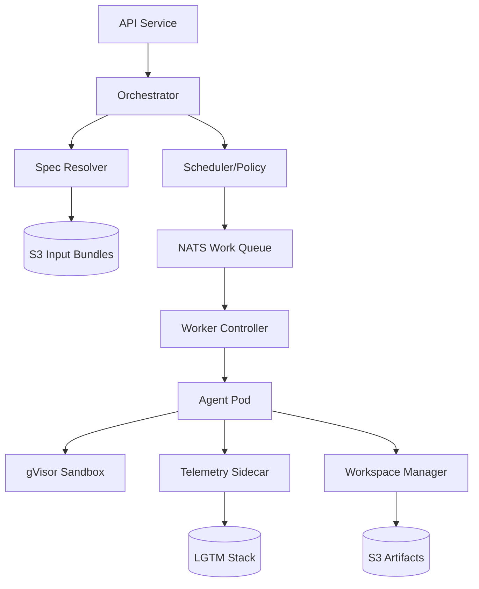

# Archive Agentic Execution Architecture

**Status**: Proposal (Unified)
**Date**: 2026-03-13
**Synthesized From**: Claude, Codex, and Gemini Proposals

---

## 1. Introduction

The Archive Agentic Execution engine is the operational substrate for autonomous
agent operations. This document defines a unified architecture designed to
execute many simultaneous agents with strong security isolation, predictable
scaling, and deep observability.

The architecture follows a **Control Plane / Data Plane** separation, utilizing
Kubernetes for orchestration and gVisor for syscall-level sandboxing.

---

## 2. Design Principles

- **Strong Isolation**: Every agent run executes in a dedicated, hardened
  container. High-security tasks are sandboxed via gVisor (`runsc`).
- **Asynchronous Orchestration**: An event-driven control plane decouples task
  submission from execution, providing resilience against system bursts.
- **Total Reproducibility**: Immutable input bundles ensure agents operate
  against a fixed, validated state of the repository and planning artifacts.
- **Durable Failure Domains**: Failures in individual agent runs or services are
  contained and do not cascade to unrelated executions.
- **Ephemeral Workspaces**: Workspaces are copy-on-write (COW) and discarded
  after completion, ensuring zero state leakage between runs.
- **Observability-First**: Full transparency into agent logs, metrics, and
  traces is mandatory for debugging autonomous logic.

---

## 3. Architecture Overview

### 3.1 Control Plane

- **API Service**: Stateless REST/gRPC gateway for run submission and tracking.
- **Orchestrator**: Manages the run state machine (Submitted → Validated →
  Scheduled → Running → Completed).
- **Spec Resolver**: Validates `spec.md`, `plan.md`, and `tasks.md`. It packages
  an immutable snapshot of the repository and plan into an **Input Bundle**.
- **Scheduler & Policy Engine**: Enforces quotas, selects resource classes, and
  performs **Conflict Detection** to prevent parallel branch collisions.

### 3.2 Message Layer

- **Work Queue (NATS JetStream)**: Durable, prioritized lanes (Critical,
  Standard, Background) for task dispatch.
- **Event Mesh**: A real-time bus for heartbeats, state transitions, and
  telemetry events.

### 3.3 Execution Plane

- **Worker Controller**: A Kubernetes Operator managing the lifecycle of
  `AgentRun` custom resources.
- **Agent Pod**: A multi-container pod featuring:
  - **Init Container**: Fetches and unpacks the Input Bundle.
  - **Agent Container**: The primary runtime (Claude, Gemini, etc.) running in a
    hardened gVisor sandbox.
  - **Telemetry Sidecar**: Real-time log streaming and metrics collection.
- **Workspace Manager**: Enforces the overlay filesystem and validates output
  manifests before persisting artifacts.

---

## 4. Key Features

### 4.1 Immutable Input Bundles (Claude)

Before a run begins, the Spec Resolver resolves the target repository commit and
planning artifacts into a versioned, compressed bundle. The agent container
mounts this bundle as a read-only volume. This eliminates "moving target" bugs
where the repository changes during a long-running implementation task.

### 4.2 Resource & Execution Classes (Codex)

To optimize cluster utilization and cost, runs are assigned to specific classes:

| Class | CPU | RAM | Storage | Runtime | Use Case |
| --- | --- | --- | --- | --- | --- |
| **Nano** | 0.1 | 256MB | 1GB | containerd | Metadata/Status |
| **Standard** | 1.0 | 2GB | 10GB | containerd | Feature/Bugfix |
| **Heavy** | 4.0 | 8GB | 50GB | containerd | Large Analysis |
| **Secure** | 2.0 | 4GB | 20GB | **gVisor** | Auth/Platform |

### 4.3 Conflict Detection (Claude)

To support high concurrency, the Scheduler maintains a registry of active
branches and file paths. If Task B attempts to modify a file currently being
edited by Task A, Task B is queued until Task A's run completes or fails,
preventing complex merge conflicts.

---

## 5. Security Model

- **Syscall Sandboxing**: gVisor provides a second kernel boundary, intercepting
  all syscalls made by the agent process.
- **Network Isolation**: Default deny-all egress. Explicit allowlists are
  required for Model APIs, GitHub, and Artifact Storage.
- **Credential Injection**: Short-lived, scoped credentials (IRSA/Workload
  Identity) are projected as secrets and revoked immediately upon pod exit.
- **Least Privilege**: Agents run as non-root users with a read-only root
  filesystem.

---

## 6. Execution Lifecycle

1. **Submit**: API receives a task request.
2. **Validate**: Spec Resolver confirms planning gates (T-Gates) are satisfied.
3. **Package**: Input Bundle is uploaded to S3; state set to `Scheduled`.
4. **Enqueue**: Task is placed in the NATS lane based on priority.
5. **Provision**: Worker Controller launches a Pod on a pre-warmed node.
6. **Execute**: Agent performs its task, emitting structured logs and events.
7. **Persist**: Workspace Manager pushes declared artifacts to S3.
8. **Sync**: GitHub Integration Service updates issues and creates PRs.
9. **Purge**: Ephemeral workspace and pod are deleted.

---

## 7. Observability Stack

The system leverages the **LGTM Stack** for unified visibility:

- **Loki**: Structured JSONL logs queryable by `RunID` and `TaskID`.
- **Grafana**: Dashboards for queue depth, failure rates, and cost per run.
- **Tempo**: OpenTelemetry traces spanning from API call to agent git-commit.
- **Mimir/Prometheus**: Resource utilization and system health metrics.

---

## 8. Recommended Technology Stack

| Layer | Technology |
| --- | --- |
| **Compute** | Kubernetes (EKS/GKE) |
| **Sandboxing** | gVisor (`runsc`) |
| **Messaging** | NATS JetStream |
| **Metadata** | PostgreSQL (Aurora Serverless) |
| **Artifacts** | S3 / Google Cloud Storage |
| **Observability** | OpenTelemetry + Grafana Cloud |
| **Scaling** | KEDA (Kubernetes Event-Driven Autoscaling) |

---

## 9. Phased Delivery Backlog

### Phase 1: MVP

- Kubernetes-based execution with single-pod isolation.
- Basic NATS-driven work queue.
- Artifact persistence to S3.
- Manual conflict resolution.

### Phase 2: Operational Scale

- Resource Classes and KEDA-based autoscaling.
- Automated Conflict Detection.
- Full LGTM observability stack.
- gVisor runtime for `Secure` class.

### Phase 3: Enterprise Features

- Multi-region worker pools.
- Per-team quota and credit enforcement.
- Event-driven triggers (Webhook → Execution).

---

## 10. Required ADRs

The following decisions must be ratified in `docs/adr/` before Phase 1:

1. **ADR-001**: Cloud Provider & Kubernetes Distribution.
2. **ADR-002**: NATS vs. Alternative Messaging (e.g., SQS/SNS).
3. **ADR-003**: Secret Management & Injection Strategy.
4. **ADR-004**: Artifact Manifest Schema & Persistence Contract.
